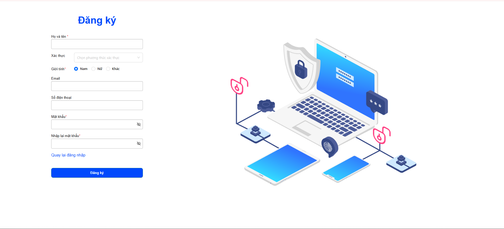
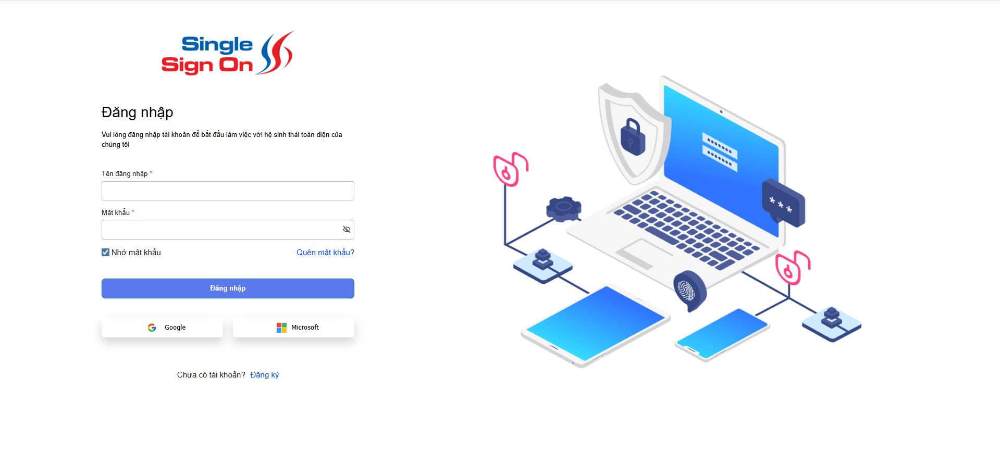

<h2 align="center">
    <a href="https://dainam.edu.vn/vi/khoa-cong-nghe-thong-tin">
    🎓 Faculty of Information Technology (DaiNam University)
    </a>
</h2>
<h2 align="center">
  HỆ THỒNG QUẢN LÝ HỢP ĐỒNG ĐIỆN TỬ
</h2>

    

        
        
        
    

## 📖 1. Giới thiệu hệ thống 

Hệ thống **E-contract Mobifone** là nền tảng quản lý hợp đồng điện tử, giúp:

- Tạo, lưu trữ và quản lý hợp đồng trực tuyến.  
- Kiểm tra chữ ký số và phê duyệt hợp đồng.  
- Theo dõi trạng thái hợp đồng theo thời gian thực.  
- Đảm bảo bảo mật dữ liệu và tuân thủ các quy định pháp lý về hợp đồng điện tử.

Hệ thống được xây dựng bằng **Angular (front-end)** và **Java/Node.js (back-end)**, hỗ trợ cơ chế client/server để gửi và nhận dữ liệu một cách nhanh chóng và bảo mật.

🖥️ Quản lý người dùng:

    Tạo, sửa, xóa người dùng.

    Phân quyền theo vai trò: admin, nhân viên, khách hàng.

💻 Quản lý hợp đồng:

    Tạo hợp đồng mới, chỉnh sửa hợp đồng.  

    Upload và lưu trữ file hợp đồng (PDF, Word).  

    Gửi hợp đồng để ký điện tử.

🎯 Ký điện tử

    Xác thực chữ ký số. 
    Ký hợp đồng trực tuyến và lưu lại thông tin xác thực. 

💻 Theo dõi trạng thái

    Trạng thái hợp đồng: Chưa ký, Đang ký, Đã ký.
    Log chi tiết lịch sử thay đổi hợp đồng.

    

## 2. Công nghệ sử dụng

 
 
 
 
 
 
 
 

 

## 3. Một số hình ảnh của hệ thống
 
🖥️ Giao diện màn đăng ký

🖥️ Giao diện màn đăng nhập

## 4. Các bước cài đặt
🔧 Bước 1. Chuẩn bị môi trường

    Node.js (phiên bản >=16.x) và npm (hoặc yarn)

    Angular CLI (phiên bản >=15.x)

    Java JDK (phiên bản 11 trở lên)

    Maven (quản lý build backend)

    MySQL hoặc database tương thích đã được cài đặt và cấu hình sẵn
🗄️ Bước 2. Cài đặt và chạy Frontend (Angular)

    Cài đặt Angular CLI (nếu chưa có):    
    
    cd econtract-web   
    
    npm install

    ng serve --open

📦 Bước 3. Cài đặt và chạy Backend (Java Spring Boot)

    cd econtract-backend
    
    mvn clean install
    
    mvn spring-boot:run
    

## 5. Liên hệ

Contact me:

    Trịnh Việt Hưng CNTT 16-04

    Khoa: Công nghệ thông tin - Trường Đại học Đại Nam 

   

    

