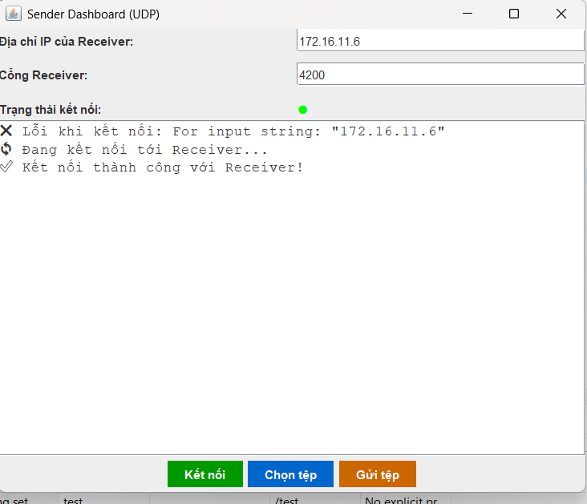
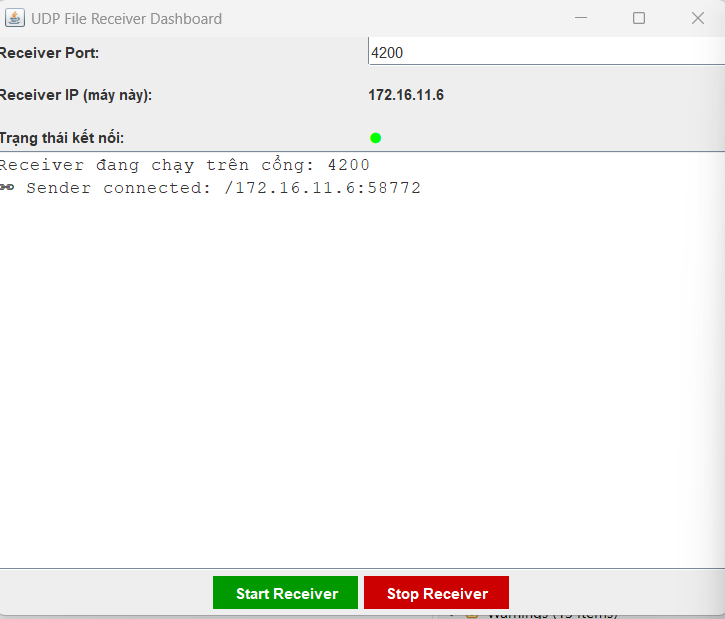

<h2 align="center">
    <a href="https://dainam.edu.vn/vi/khoa-cong-nghe-thong-tin">
    🎓 Faculty of Information Technology (DaiNam University)
    </a>
</h2>
<h2 align="center">
   TRUYỀN FILE QUA UDP
</h2>

    

        
        
        
    

## 📖 1. Giới thiệu hệ thống 

Hệ thống Truyền tệp qua mạng bằng UDP được xây dựng bằng Java với Swing GUI.
Ứng dụng cho phép Sender (máy gửi) và Receiver (máy nhận) kết nối trực tiếp thông qua UDP Socket để truyền các tệp tin (bất kỳ định dạng nào) một cách nhanh chóng.

🖥️ Receiver:

    Cho phép nhận kết nối từ Sender.

    Hiển thị thông tin file gửi đến: tên file, dung lượng, định dạng.

    Người dùng có thể chọn: Lưu file hoặc Từ chối file.

    Có tùy chọn chọn thư mục lưu file trước khi tải về.

💻 Sender:

    Giao diện trực quan để nhập IP, cổng của Receiver.

    Chọn tệp bất kỳ từ máy tính để gửi.

    Hiển thị trạng thái kết nối qua chấm tròn (🔴/🟢).

    Log chi tiết quá trình gửi file (kết nối, tên tệp, dung lượng, tiến trình).

🎯 Ý nghĩa của ứng dụng

    1️⃣ Ứng dụng kiến thức lập trình mạng
    Giúp sinh viên/lập trình viên hiểu rõ cách hoạt động của UDP Socket và mô hình Client – Server, đồng thời củng cố kiến thức lý thuyết bằng sản phẩm thực tế.

    2️⃣ Mô phỏng quá trình truyền file
    Minh họa trực quan cách các hệ thống gửi – nhận file trong mạng LAN hoạt động, từ kết nối, trao đổi dữ liệu đến đóng kết nối.

    3️⃣ Nâng cao trải nghiệm người dùng
    Có giao diện Java Swing thân thiện, dễ thao tác; biểu tượng trạng thái 🔴🟢 trực quan; hỗ trợ chọn/từ chối nhận file, đảm bảo an toàn dữ liệu.

    4️⃣ Khả năng mở rộng
    Có thể phát triển thêm thành công cụ truyền file trong doanh nghiệp, chia sẻ dữ liệu nhanh qua LAN, hoặc tích hợp thêm bảo mật, lưu lịch sử, quản lý nhiều kết nối.

    5️⃣ Ý nghĩa giáo dục – nghiên cứu
    Là công cụ minh họa hữu ích trong học tập, nghiên cứu về socket, giúp sinh viên thực hành và làm nền tảng mở rộng sang các chủ đề mã hóa – tối ưu – bảo mật mạng.

## 2. Công nghệ sử dụng

 
 
 
 
 
 
 
 
 
 
 

## 3. Một số hình ảnh của hệ thống
 
🖥️ Giao diện Client

🖥️ Giao diện Server

## 4. Các bước cài đặt
🔧 Bước 1. Chuẩn bị môi trường

    Cài đặt **JDK 8+** (Java Development Kit) 

    👉 [Tải JDK tại đây](https://www.oracle.com/java/technologies/javase-downloads.html)

    IDE hỗ trợ Java: **Eclipse** hoặc **NetBeans**
🗄️ Bước 2. Clone dự án về máy

    Mở **Terminal (Linux/macOS)** hoặc **Command Prompt/PowerShell (Windows)** và chạy lệnh sau:
    
    git clone https://github.com/hung-debug/Lap_Trinh_Mang_1604_004Truyen-file-UDP.git
    cd Lap_Trinh_Mang_1604_004Truyen-file-UDP

📦 Bước 3. Mở dự án trong IDE

    Mở Eclipse hoặc NetBeans

    Chọn Import Project → trỏ đến thư mục vừa clone về
    
⚙️ Bước 4. Chạy chương trình

    Chạy Receiver.java để khởi động máy nhận

    Chạy Sender.java để khởi động máy gửi

▶️ Bước 5. Kiểm tra hoạt động

    Nhập IP và Port của Receiver vào Sender

    Ấn Kết nối → chấm trạng thái chuyển 🟢 nếu thành công

    Chọn file cần gửi → ấn Gửi tệp
    
    Ở Receiver, chọn Lưu file hoặc Từ chối

## 5. Liên hệ

Contact me:

    Trịnh Việt Hưng CNTT 16-04

    Khoa: Công nghệ thông tin - Trường Đại học Đại Nam 

   

    

